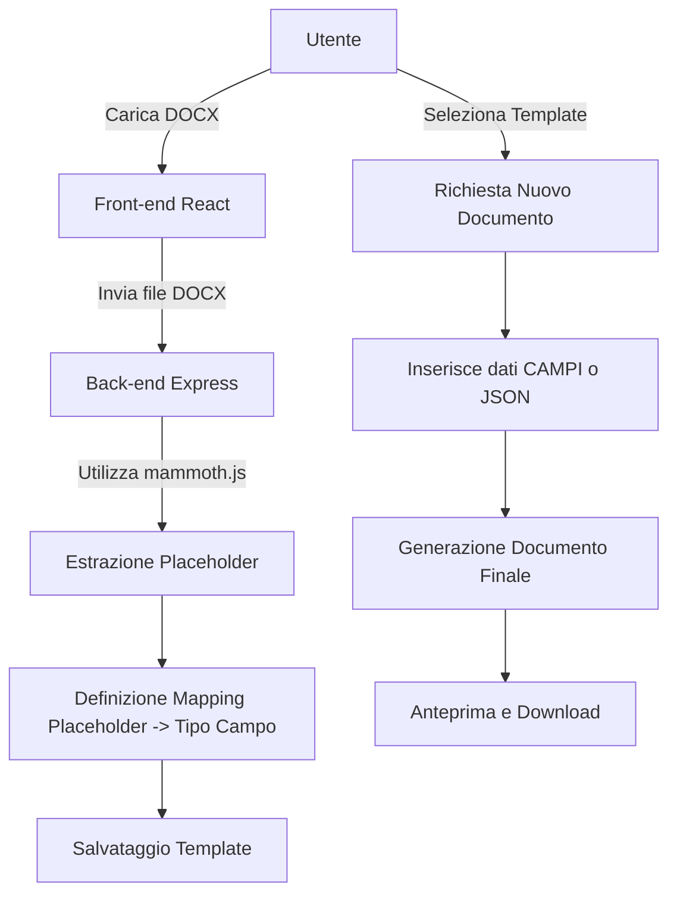

# Piano Architettura - Web App per Document Models

## Introduzione
Questa applicazione consente di caricare file DOCX con placeholder personalizzati e definire modelli per generare documenti compilati. In questo piano, viene descritta l'architettura e il flusso di lavoro dell'applicazione.

## Architettura Generale

### Back-end (Node.js con Express)
- **Caricamento DOCX:** Endpoint per il caricamento del file DOCX.
- **Parsing:** Utilizzo di mammoth.js per estrarre il contenuto e rilevare i placeholder (es. `{{placeholder}}`).
- **Salvataggio Template:** Endpoint per salvare il template documento, includendo il mapping dei placeholder ai tipi di campo (testo, testo formattato, tabella, ecc.).
- **Creazione Documento:** Endpoint per generare il documento finale sostituendo i placeholder con i dati forniti.
- **Persistenza:** Gestione della persistenza dei template (utilizzo di un database o storage su file).

### Front-end (React)
- **Interfaccia a Due Pannelli:**
  - **Sinistra:** Form dinamico per compilare i campi oppure modalità JSON per incollare lo schema.
  - **Destra:** Anteprima in tempo reale del documento generato (HTML o PDF).
- **Caricamento File:** Funzionalità di drag & drop per il caricamento del file DOCX.
- **API REST:** Comunicazione con il back-end tramite API REST.

## Flusso di Lavoro

1. **Caricamento Template**
   - L'utente carica il file DOCX.
   - Il back-end utilizza mammoth.js per estrarre e rilevare i placeholder.
   - L'utente definisce il tipo di campo per ogni placeholder, inclusi quelli in formato tabella.

2. **Creazione Documento**
   - L'utente seleziona un template e compila i campi tramite form o inserisce un JSON.
   - Il back-end genera il documento finale sostituendo i placeholder con i valori forniti.

3. **Anteprima e Download**
   - Il documento viene visualizzato in anteprima.
   - L'utente può scaricare il documento finale in formato Word o in altri formati.

## Diagramma di Architettura

## Prossimi Passi
- Configurare il progetto back-end con Node.js ed Express.
- Configurare il front-end con React e organizzare l'interfaccia a due pannelli.
- Integrare mammoth.js per il parsing dei file DOCX.
- Implementare la logica di rilevamento e gestione dei placeholder, anche per le tabelle.
- Creare le API REST per il salvataggio dei template e la generazione dei documenti.
- Implementare l'anteprima del documento e la funzionalità di download.